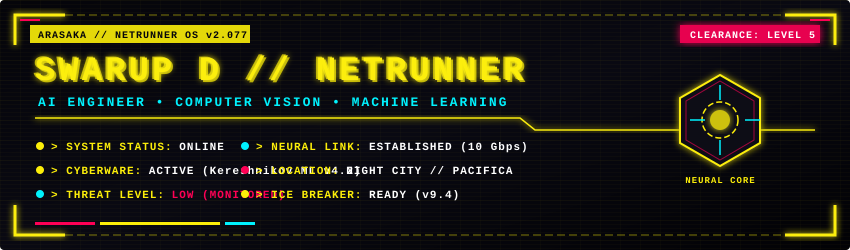
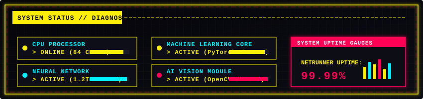

<div align="center">

<!-- ARASAKA NETRUNNER HERO HEADER BANNER -->


<br/>

```text
 ▄▄▄▄▄▄▄▄▄▄▄  ▄▄▄▄▄▄▄▄▄▄▄  ▄▄▄▄▄▄▄▄▄▄▄  ▄▄▄▄▄▄▄▄▄▄▄  ▄  ▄▄▄▄▄▄▄▄▄▄▄  ▄▄▄▄▄▄▄▄▄▄▄    ▄▄▄▄▄▄▄▄▄▄▄ 
▐░░░░░░░░░░░▌▐░░░░░░░░░░░▌▐░░░░░░░░░░░▌▐░░░░░░░░░░░▌▐░▌▐░░░░░░░░░░░▌▐░░░░░░░░░░░▌  ▐░░░░░░░░░░░▌
▐░█▀▀▀▀▀▀▀█░▌▐░█▀▀▀▀▀▀▀▀▀ ▐░█▀▀▀▀▀▀▀█░▌▐░█▀▀▀▀▀▀▀█░▌▐░▌▐░█▀▀▀▀▀▀▀█░▌▐░█▀▀▀▀▀▀▀█░▌  ▐░█▀▀▀▀▀▀▀█░▌
▐░▌       ▐░▌▐░▌          ▐░▌       ▐░▌▐░▌       ▐░▌▐░▌▐░▌       ▐░▌▐░▌       ▐░▌  ▐░▌       ▐░▌
▐░█▄▄▄▄▄▄▄█░▌▐░█▄▄▄▄▄▄▄▄▄ ▐░█▄▄▄▄▄▄▄█░▌▐░█▄▄▄▄▄▄▄█░▌▐░▌▐░█▄▄▄▄▄▄▄█░▌▐░█▄▄▄▄▄▄▄█░▌  ▐░▌       ▐░▌
▐░░░░░░░░░░░▌▐░░░░░░░░░░░▌▐░░░░░░░░░░░▌▐░░░░░░░░░░░▌▐░▌▐░░░░░░░░░░░▌▐░░░░░░░░░░░▌  ▐░▌       ▐░▌
▐░█▀▀▀▀▀▀▀█░▌ ▀▀▀▀▀▀▀▀▀█░▌▐░█▀▀▀▀▀▀▀█░▌▐░█▀▀▀▀█░░░░▌▐░▌▐░█▀▀▀▀▀▀▀█░▌▐░█▀▀▀▀▀▀▀▀▀   ▐░▌       ▐░▌
▐░▌       ▐░▌          ▐░▌▐░▌       ▐░▌▐░▌     ▐░█░▌▐░▌▐░▌       ▐░▌▐░▌            ▐░▌       ▐░▌
▐░█▄▄▄▄▄▄▄█░▌ ▄▄▄▄▄▄▄▄▄█░▌▐░▌       ▐░▌▐░▌      ▐░█▌▐░▌▐░▌       ▐░▌▐░▌            ▐░█▄▄▄▄▄▄▄█░▌
▐░░░░░░░░░░░▌▐░░░░░░░░░░░▌▐░▌       ▐░▌▐░▌       ▐░▌▐░▌▐░▌       ▐░▌▐░▌            ▐░░░░░░░░░░░▌
 ▀▀▀▀▀▀▀▀▀▀▀  ▀▀▀▀▀▀▀▀▀▀▀  ▀         ▀  ▀         ▀  ▀  ▀         ▀  ▀              ▀▀▀▀▀▀▀▀▀▀▀ 
```

> **NETRUNNER ACCESS GRANTED**  
> **CONNECTION ESTABLISHED**  
> **WELCOME TO NIGHT CITY**

<br/>

<p align="center">
  <a href="#-system-status-panel">System Status</a> •
  <a href="#-cyberware-installed">Cyberware</a> •
  <a href="#-mission-archive">Mission Archive</a> •
  <a href="#-neural-statistics">Neural Stats</a> •
  <a href="#-spaceship-reconnaissance-matrix">Spaceship Graph</a> •
  <a href="#-contact-network">Contact</a>
</p>

</div>

---

## ⚡ SYSTEM STATUS PANEL

<div align="center">



</div>

```bash
┌──(arasaka㉿netrunner-deck)-[~]
└─$ ./diagnostics.sh --full-scan
[+] SYSTEM STATUS: ONLINE
[+] NEURAL NETWORK: ACTIVE (PyTorch / TensorFlow CUDA Acceleration)
[+] MACHINE LEARNING CORE: ACTIVE (Deep Learning & Spatial AI Pipeline)
[+] AI VISION MODULE: ACTIVE (Real-time Object Detection & Tracking)
[+] UPTIME: 99.99% // NIGHT CITY GRID POWER STABLE
```

---

## 🦾 CYBERWARE INSTALLED

<div align="center">

### ⚡ AI & MACHINE LEARNING CYBERWARE


### ⚙️ DEVOPS, INFRASTRUCTURE & BACKEND


### 🌐 FULL-STACK INTERACTION


</div>

---

## 📂 MISSION ARCHIVE

```bash
┌──[ MISSION ARCHIVE // NIGHT CITY DATABASE ]
```

<div align="center">

| MISSION NAME | STATUS | DESCRIPTION | TECH STACK |
| :--- | :---: | :--- | :--- |
| **`MISSION #01: NEURAL_VISION_OS`** |  | Real-time edge computer vision & multi-camera object tracking pipeline | `PyTorch` `OpenCV` `FastAPI` `Docker` |
| **`MISSION #02: CYBER_LLM_AGENT`** |  | Autonomous agentic RAG system with neural memory & vector search | `Python` `LangChain` `Qdrant` `PostgreSQL` |
| **`MISSION #03: AUTONOMOUS_AV_NAV`** |  | Deep reinforcement learning 3D spatial vehicle navigation simulator | `C++` `Python` `PyTorch` `CUDA` |

</div>

---

## 🧠 NEURAL STATISTICS

<div align="center">

<table border="0">
  <tr>
    <td width="50%">
      
    </td>
    <td width="50%">
      
    </td>
  </tr>
</table>

<br/>


</div>

---

## 🚀 SPACESHIP RECONNAISSANCE MATRIX

> **NEON SPACECRAFT PATROL ACTIVE // ILLUMINATING NIGHT CITY CONTRIBUTION GRID**

<div align="center">


</div>

---

## 📡 CONTACT NETWORK

```bash
┌──[ INITIALIZING SECURE COMMUNICATION CHANNELS ]
```

<div align="center">

<a href="https://github.com/SwarupRock">
  
</a>
<a href="https://linkedin.com">
  
</a>
<a href="mailto:swarup@example.com">
  
</a>
<a href="https://swarup.dev">
  
</a>

</div>

---

<div align="center">

<!-- NIGHT CITY SKYLINE ANIMATED FOOTER -->


</div>
